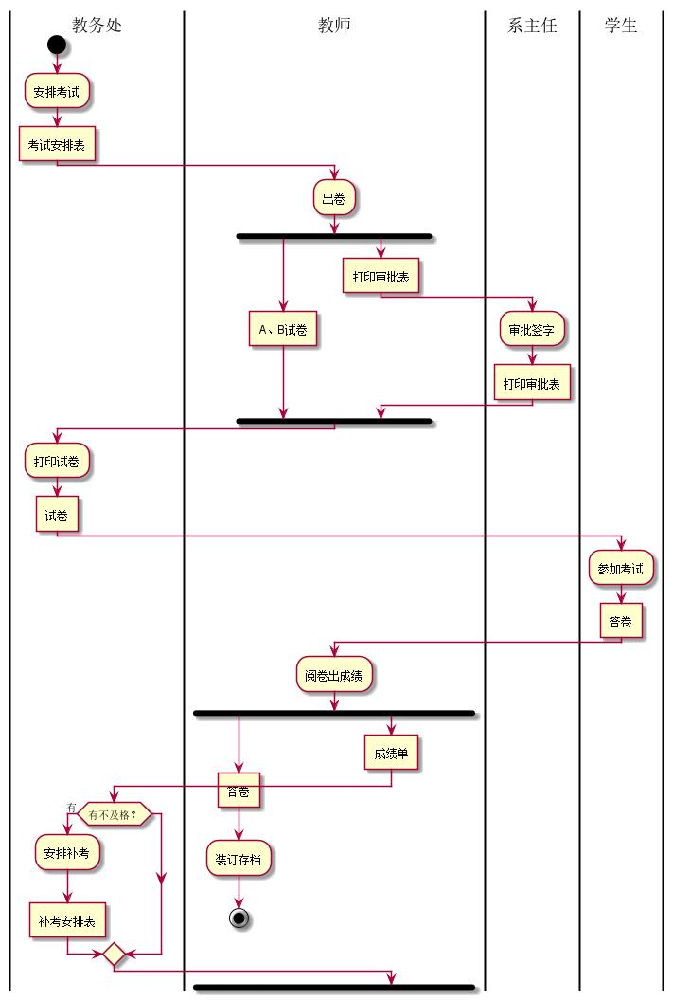
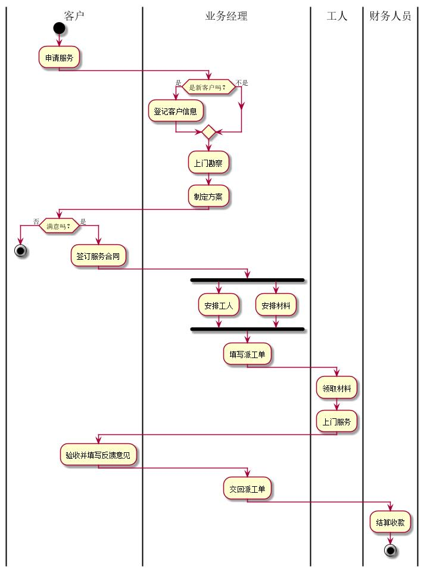

**PlantUML源码如下：**
|学号|班级|姓名|照片|
|:-------:|:-------------: | :----------:|:---:|
|201510414410|软件(本)15-4|刘俊成||
``` 1
@startuml
|教务处|
start
:安排考试;
:考试安排表]
|教师|
:出卷;
fork
    :A、B试卷]

fork again
    :打印审批表]
    |系主任|
           :审批签字;
           :打印审批表]
endfork

|教务处|
:打印试卷;
:试卷]
|学生|
:参加考试;
:答卷]
|教师|
:阅卷出成绩;
fork
:答卷]
:装订存档;
stop
fork again
:成绩单]
|教务处|
if(有不及格？) then(有)
    :安排补考;
:补考安排表]


@enduml
```

**业务流程图如下：**



**流程说明：**

没有什么特别说明的，就按照书上的图做就行了

## 流程图2： 客户维修服务流程

**PlantUML源码如下：**

``` 2
@startuml
|客户|
start
:申请服务;
|业务经理|
if(是新客户吗？)then(是)
:登记客户信息;
else(不是)
endif
:上门勘察;
:制定方案;
|客户|
if(满意吗？)then(否)
stop
else(是)
:签订服务合同;
|业务经理|
fork
:安排工人;
fork again
:安排材料;
endfork
:填写派工单;
|工人|
:领取材料;
:上门服务;
|客户|
:验收并填写反馈意见;
|业务经理|
:交回派工单;
|财务人员|
:结算收款;
stop

@enduml
```

**业务流程图如下：**



**流程说明：**
没有什么特别说明的，就按照书上的图做就行了
