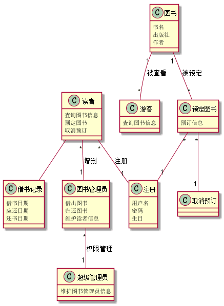
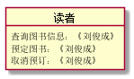
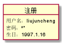
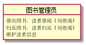

--------------------------
|学号|班级|姓名|照片|
|:-------:|:-------------: | :----------:|:---:|
|201510414410|软件(本)15-4|刘俊成||

实验三 图书管理系统领域对象建模
------------

### 1.1 类图PlantUML源码如下：
```
@startuml
class 超级管理员 {
      维护图书管理员信息
}
class 读者 {
      查询图书信息
      预定图书
      取消预订
}
class 游客{
       查询图书信息
}
class 注册{
      用户名
      密码
      生日
}
class 图书管理员{
     借出图书
     归还图书
     维护读者信息
}
class 图书 {
   书名
   出版社
   作者
}
class 预定图书 {
   预订信息
}
class 取消预订 {
}
class 借书记录{
   借书日期
   应还日期
   还书日期
}
图书管理员"*"--"1"超级管理员:权限管理
读者"*"--"1"图书管理员:增删
读者"*"--"1"注册:注册
图书"1"--"*"预定图书:被预定
图书"1"--"*"游客:被查看
预定图书"*"--"1"注册
预定图书"*"--"1"取消预订
读者--借书记录
@enduml
```

### 1.2 类图如下：



### 1.3 类图说明:
~~~
该类图由各种实体类组成，参考实验二中的
用例图来设计各种类
~~~

## 2. 图书管理系统的对象图

###     2.1 类“超级管理员”对象图
```
源码：
@startuml
object  超级管理员 {
             维护图书管理员信息：修改图书管理员
       }
@enduml
```


###     2.2 类“读者”对象图
```
源码：
@startuml
object  读者 {
              查询图书信息：《刘俊成》
              预定图书：《刘俊成》
              取消预订：《刘俊成》
        }
@enduml
```


###     2.3 类“游客”对象图
```
源码：
@startuml
object 游客{
       查询图书信息：《刘俊成》
}
@enduml
```


###     2.4 类“注册”对象图
```
源码：
@startuml
object 注册{
      用户名：liujuncheng
      密码：******
      生日：1997.1.16
}
@enduml
```


###     2.5 类“图书管理员”对象图
```
源码：
@startuml
object 图书管理员{
     借出图书：读者借阅《刘俊成》
     归还图书：读者归还《刘俊成》
     维护读者信息
}
@enduml
```

