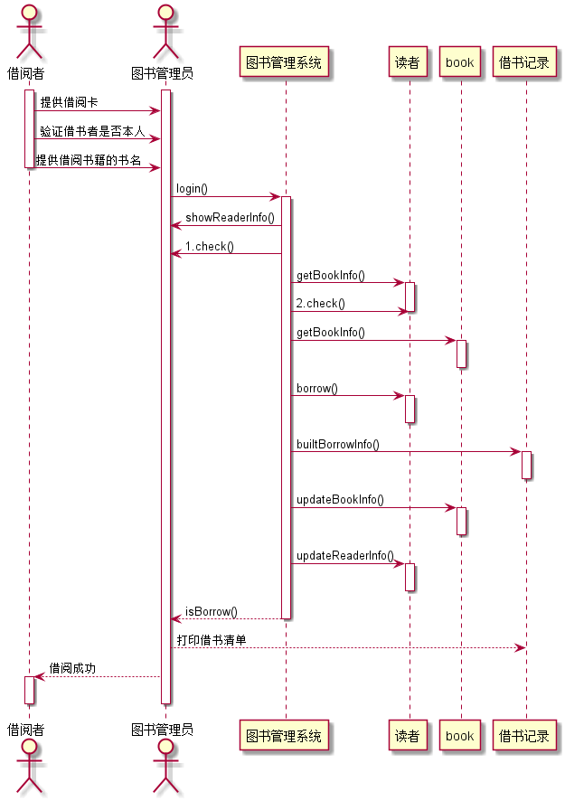
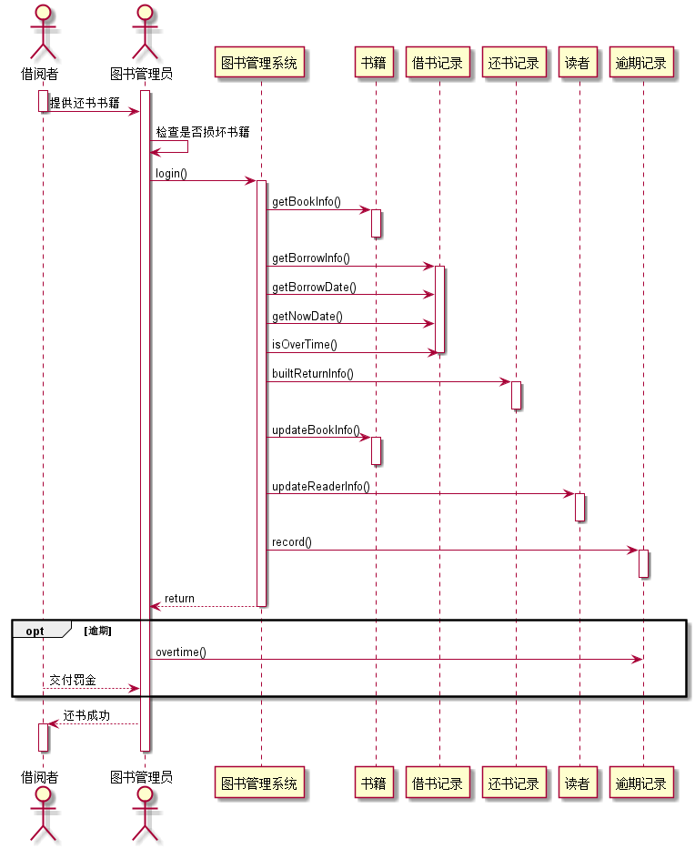
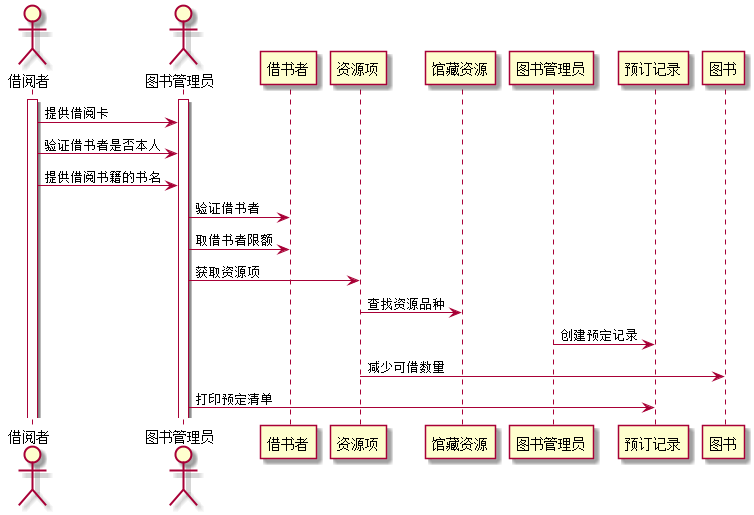

--------------------------
|学号|班级|姓名|照片|
|:-------:|:-------------: | :----------:|:---:|
|201510414410|软件(本)15-4|刘俊成||

实验四 图书管理系统顺序图绘制

## 图书管理系统的顺序图

## 1. 借书用例
## 1.1. 借书用例PlantUML源码

``` sequence
@startuml
actor  借书者 as reader
actor  图书管理员 as bookAdmin
activate reader
reader->bookAdmin:readerId
reader->bookAdmin:bookId
deactivate reader
activate bookAdmin
activate 图书管理系统
bookAdmin->图书管理系统:1.login()
bookAdmin->图书管理系统:2.checkReader(int readerId)
bookAdmin->图书管理系统:3.checkBook(int bookId)
bookAdmin<-图书管理系统:result():true or false
deactivate bookAdmin
activate record
图书管理系统->record:4.getReader(int readerId)
图书管理系统<-record:result():true or false
图书管理系统->record:5.updateRecord(int readerId,int bookId)
deactivate record
activate book
图书管理系统->book:6.getBook(int bookId)
图书管理系统<-book:result():true or false
图书管理系统->book:7.updateBook(int bookId)
deactivate book
activate reader
图书管理系统->reader:result():true or false
deactivate reader
deactivate 图书管理系统
@enduml
```
## 1.2. 借书用例顺序图


## 1.3. 借书用例顺序图说明
```
1. login()：图书管理员登录
2. checkReader(int readerId)：核查读者
3. checkBook(int bookId)：核查图书
4. getReader(int readerId)：获取读者
5. updateRecord(int bookId,int readerId)：修改读者记录
6. getBook(int bookId)：获取图书
7. updateBook(int bookId)：修改图书 
8. result()：返回执行结果
 ```
  
## 2. 还书用例
## 2.1. 还书用例PlantUML源码

``` sequence
@startuml
actor  还书者 as returnBook
actor  图书管理员 as bookAdmin
activate returnBook
activate bookAdmin
returnBook->bookAdmin:readerId
returnBook->bookAdmin:bookId
deactivate returnBook
bookAdmin->图书管理系统:1.login()
activate 图书管理系统
bookAdmin->图书管理系统:2.checkReader(int readerId)
bookAdmin->图书管理系统:3.checkBook(int bookId)
bookAdmin<-图书管理系统:result():true or false
deactivate bookAdmin
activate record
图书管理系统->record:4.getReader(int readerId)
图书管理系统<-record:result():true or false
图书管理系统->record:5.updateRecord(int readerId,int bookId)
deactivate record
activate book
图书管理系统->book:6.getBook(int bookId)
图书管理系统<-book:result():true or false
图书管理系统->book:7.updateBook(int bookId)
deactivate book
activate returnBook
图书管理系统->returnBook:result():true or false
deactivate returnBook
deactivate 图书管理系统
@enduml
```

## 2.2. 还书用例顺序图


## 2.3. 还书用例顺序图说明
```
1. login()：图书管理员登录
2. checkReader(int readerId)：核查读者
3. checkBook(int bookId)：核查图书
4. getReader(int readerId)：获取读者
5. updateRecord(int bookId,int readerId)：修改读者记录
6. getBook(int bookId)：获取图书
7. updateBook(int bookId)：修改图书 
8. result()：返回执行结果
```

## 3. 预借用例
## 3.1. 预借用例PlantUML源码

``` 

@startuml
actor  借阅者 as reader
actor  图书管理员 as admin
activate reader
activate admin
reader->admin:提供借阅卡
reader->admin:验证借书者是否本人
reader->admin:提供借阅书籍的书名

admin->借书者:验证借书者
admin->借书者:取借书者限额
admin->资源项:获取资源项
资源项->馆藏资源:查找资源品种
图书管理员->预订记录:创建预定记录
资源项->图书:减少可借数量
admin->预订记录:打印预定清单
@enduml


```

## 3.2.预借用例顺序图


## 3.3. 借书用例顺序图说明
```

	1.验证借书者信息和额度
	2.图书管理员发起借书请求
	3.减少资源可借数量和可借额度
	4.创建借书记录

```
